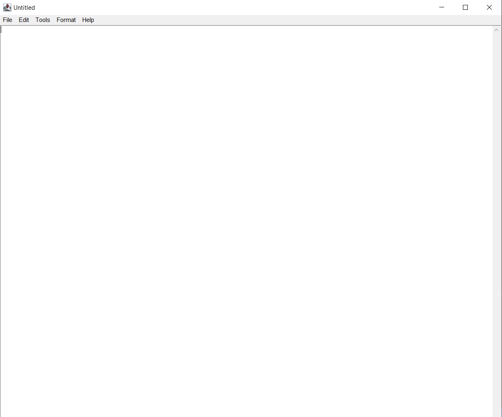

<h2 align ="center"> MULTI-THEMED TEXT-EDITOR (Notepad)</h2>

<h3> PURPOSE OF PROJECT: </h3>

* To make a Text Editor for writing codes in order to test the accuracy without giving suggestions(Unlike Modern IDE's).
* To increase the accuracy of writing code(Helpful in interviews).
* To compile and run codes of all languages in the same folder (Saving time in shifting multiple folders) using CLI.
* To make a self-created text editor.

<h3> VERSION OF PROJECT: </h3>

<h3> SOFTWARE AND OPERATING SYSTEM USED FOR DEVELOPEMENT OF PROJECT: </h3>

* Notepad (Windows)

<h3> AUTHORS: </h3>

- [x] Akshit Mangotra<h1>
-------------------------------------------------------------------------------------------

### User Instructions:

#### How to run this project.
* Install JDK 11 or more on the machine.
* Please make sure that it has applet viewer installed with JDK.
* Open terminal (for Mac) or command prompt (for windows ) and navigate to the directory where the project is saved.
* Run the following command: `javac StartNotepad.java` and then run `java StartNotepad`

🙂 Enjoy the Notepad and show some love. ♥ 

--------------------------------------------------------------------------------------------

### Screenshots:

#### Opening and Writing Code in Notepad:
 
<table>
        <tr> 
        <td></td>
        <td></td>
        </tr>

</table>

#### Saving Code written and changing themes as per convenience:
 
<table>
        <tr> 
        <td></td>
        <td></td>
        <td></td>
        </tr>
</table>

